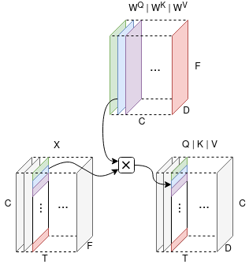

## TENT
Official implementation code of the paper: "TENT: Tensorized Encoder Transformer for temperature forecasting" [(ArXiv link)](https://arxiv.org/abs/2106.14742).




## Usage
1. Execute `TT_All_models_experiments.ipynb`.

## Citation
```
@article{bilgin2021tent,
  title={TENT: Tensorized Encoder Transformer for Temperature Forecasting},
  author={Bilgin, Onur and M{\k{a}}ka, Pawe{\l} and Vergutz, Thomas and Mehrkanoon, Siamak},
  journal={arXiv preprint arXiv:2106.14742},
  year={2021}
}
```