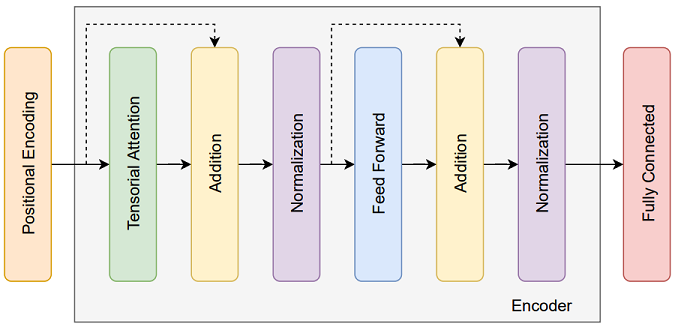

## TENT
Official implementation code of the paper: "TENT: Tensorized Encoder Transformer for temperature forecasting" [(ArXiv link)](https://arxiv.org/abs/2106.14742).


## Results


The obtained test MAE of the models for the USA and Canada dataset averaged over cities (left) and prediction time steps (right).


The comparison between the predictions of TENT model and the real measurements for hourly temperature of the test set of Vancouver.

## Attention visualization


Attention visualization for Vancouver in USA and Canada dataset. The circular graphs shows which city each of the most important heads attends to. The thickness of the line represents the amount of attention each of the heads is paying to the cities. The size of the circles indicates the importance of each city in the temperature prediction for the target city. The target city is marked as a red circle and its size corresponds to the importance of the attention to itself.

## Model architecture


## Data

In order to download the data, please email to the following addresses:

o.bilgin@student.maastrichtuniversity.nl

p.maka@student.maastrichtuniversity.nl

t.vergutz@student.maastrichtuniversity.nl

siamak.mehrkanoon@maastrichtuniversity.nl


## Usage
Execute the notebook on colab (Use TPU for TENT): [TT_All_models_experiments.ipynb](notebooks/TT_All_models_experiments.ipynb)

## Citation
If you use our data and code, please cite the paper using the following bibtex reference:
```
@article{bilgin2021tent,
  title={TENT: Tensorized Encoder Transformer for Temperature Forecasting},
  author={Bilgin, Onur and M{\k{a}}ka, Pawe{\l} and Vergutz, Thomas and Mehrkanoon, Siamak},
  journal={arXiv preprint arXiv:2106.14742},
  year={2021}
}
```

